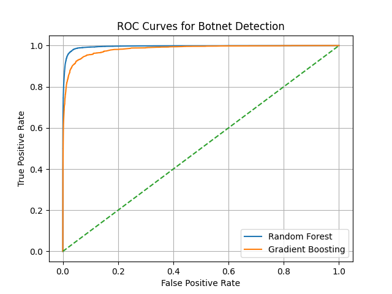
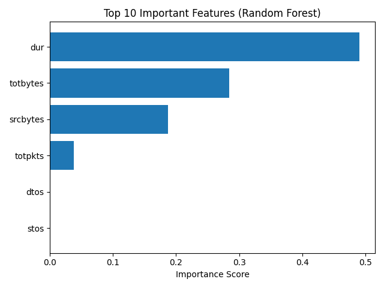

# Flow-Based Botnet Detection on the CTU-13 Dataset using Ensemble Machine Learning

This repository presents a complete end-to-end **flow-based botnet detection system** implemented using ensemble machine learning models on the **CTU-13 dataset**. The project includes full data preprocessing, model training, evaluation, ROC analysis, feature importance visualization, and a full IEEE-style research paper.

---

## 📌 Project Highlights

- ✅ Dataset: **CTU-13 Botnet Traffic Dataset**
- ✅ Models: **Random Forest, Gradient Boosting**
- ✅ Features: Flow-level network statistics
- ✅ Explainability: Feature importance analysis
- ✅ Evaluation: Accuracy, Precision, Recall, F1-score, ROC-AUC
- ✅ Paper: Full IEEE-style research paper (PDF included)

---

## 📂 Repository Structure

ctu13_baseline.py        # Main training & evaluation script
roc_curves.png           # ROC curve comparison plot
feature_importance.png  # Top 10 feature importance plot
Flow_Based_Botnet_Detection_using_Ensemble_Machine_Learning.pdf  # Research paper
.gitignore               # Prevents dataset from being pushed

---

## 📊 Experimental Results

| Model | Accuracy | Precision | Recall | F1-Score | ROC-AUC |
|--------|------------|-------------|---------|------------|------------|
| Random Forest | 0.9946 | 0.8800 | 0.7299 | 0.7979 | 0.9953 |
| Gradient Boosting | 0.9918 | 0.8428 | 0.5374 | 0.6563 | 0.9827 |

✅ **Random Forest outperforms Gradient Boosting across all major metrics.**

---

## 📈 Visual Results

### ROC Curve Comparison


### Top 10 Feature Importances (Random Forest)


Key predictive features include:
- Flow duration  
- Total bytes  
- Source bytes  
- Packet counts  

---

## ⚙️ Setup Instructions

### 1️⃣ Install Dependencies

```bash
pip install pandas numpy scikit-learn matplotlib

2️⃣ Run the Model

Place the dataset file:
capture20110810.binetflow

in the same directory and run:
python3 ctu13_baseline.py 
```
📚 Citation

If you use this work in your research, please cite:

Harshith Siddartha Kutumbaka
“Flow-Based Botnet Detection Using Ensemble Machine Learning on the CTU-13 Dataset”, 2025

⸻

🔮 Future Work
	•	Integration of LSTM and Transformer-based deep learning models
	•	Real-time deployment using Kafka and streaming pipelines
	•	Zero-day botnet detection using self-supervised learning
	•	Adversarial robustness testing against evasion attacks
